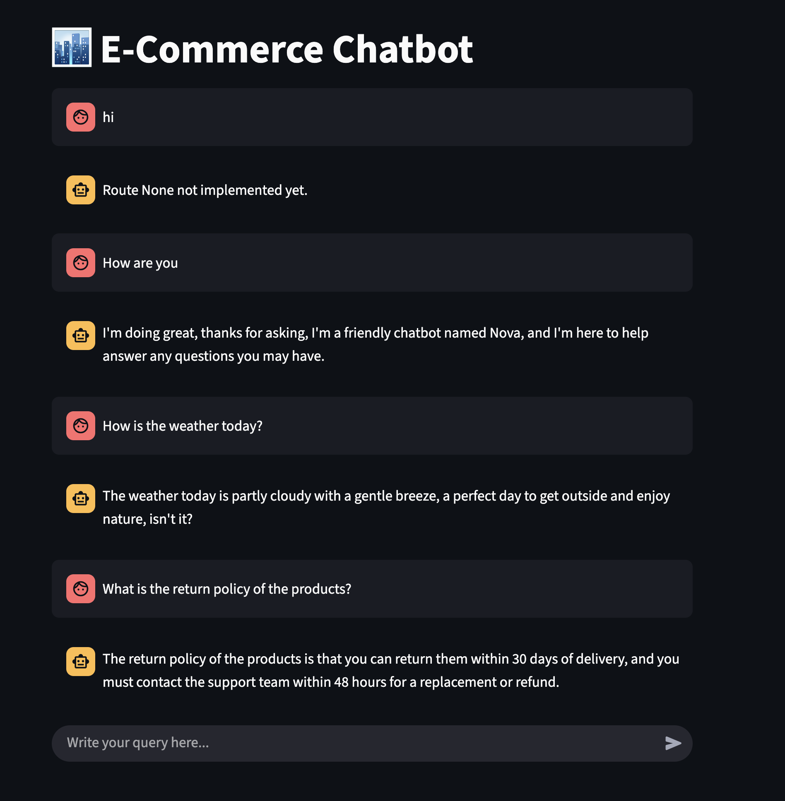
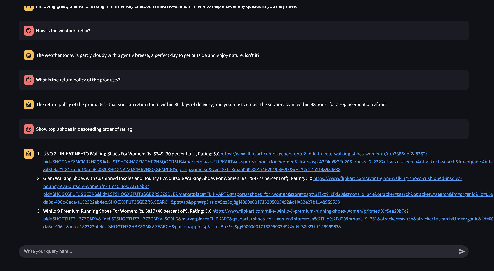
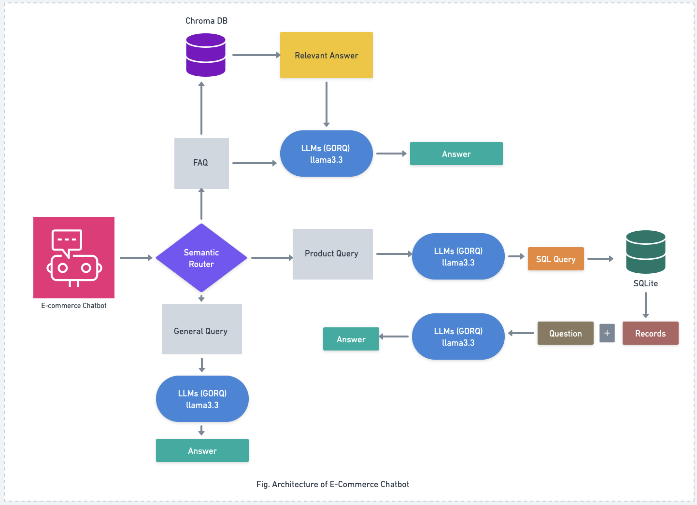

# E-Commerce Chatbot

# 📝 Project Overview
The **E-Commerce Chatbot** is an AI-powered assistant designed to enhance the user experience on XYZ’s e-commerce platform. It assists users with:
- **Frequently Asked Questions (FAQs)**
- **Product inquiries (pricing & availability)**

This solution drives engagement, improves customer satisfaction, and supports seamless interaction between customers and the platform.





# 🚀 Project Objective

**Objective 1:** Build a chatbot prototype with core functionalities for FAQs and product inquiries.

1. **FAQ Data Ingestion into Chromadb** – Efficient ingestion and vectorization of FAQs into the Chromadb vector database.
2. **Streamlit Chatbot Frontend** – Interactive, user-friendly chatbot interface built with Streamlit.
3. **Route Support:**
   - FAQs → Answers retrieved from the FAQ database.
   - Product Inquiries → Product & pricing information pulled from SQLite database.


**Objective 2:** Expand chatbot capabilities and deploy on the e-commerce website (Integration).

1. **Full-scale Deployment** – Transition from Streamlit to a production-ready environment for large-scale interactions.
2. **Website Integration** – Embed chatbot seamlessly into XYZ’s website to support live customer queries.
3. **Performance Optimization & Testing** – High accuracy and minimal latency for real-time interactions.


# 🛠️ Tech Stack
- **Language Model:** LLM Gorq (llama-3.3-70b-versatile) / HuggingFace (pluggable)
- **Embedding Function:** sentence-transformers/all-MiniLM-L6-v2
- **Frontend:** Streamlit (prototype)
- **Databases:**
  - Chromadb → FAQ vector storage
  - SQLite → Product & pricing storage
- **Routing:** Semantic router

# 👾 Architecture



# 📊 **Workflow**  
1. **User Input (Streamlit UI)** – User types a query into the chatbot (e.g., “Do you accept cash on delivery?” or “Show me top Nike shoes under 80 with rating >4.3”).
2. **Semantic Router** – Classifies the query type:
    - FAQ – general queries (payment, return policy, etc.)
    - Product – product search and filtering queries
3. **FAQ Flow (RAG Retrieval)**
    - Query sent to ChromaDB (vector database).
    - Retrieves relevant answers from stored FAQs.
    - LLM refines response → generates natural-language Answer.  
4. **Product Flow (SQL Retrieval)**
    - Query passed to LLM, which converts it into an SQL query
    - SQL query executed on SQLite database (product catalog)
    - Retrieved Records + Question are sent back to the LLM
    - LLM composes a user-friendly Answer with product details
5. **General Query** - General conversatation or query with LLMs.
6. **Response Delivery** – Final answer displayed in Streamlit UI, including links, product details, and recommendations.  


# 🖥️ **Example Usage**  

**Input:**  
```  
Q.1. What is the return policy of the products?
Q.2. How do I use a promo code during checkout? 
Q.3. Show top 3 shoes in descending order of rating
```  
**Output:**  
```  
Answer 1: The return policy of the products is that you can return them within 30 days of delivery, and you need to contact the support team within 48 hours for a replacement or refund.
Answer 2: To use a promo code during checkout, enter your promo code in the designated field..
Answer 3: 1. UNO 2 - IN-KAT-NEATO Walking Shoes For Women: Rs. 5249 (30 percent off), Rating: 5.0 https://www.flipkart.com/skechers-uno-2-in-kat-neato-walking-shoes-women/p/itm7386dbf2a5352?pid=SHOGNAZZMCMR2H8Q&lid=LSTSHOGNAZZMCMR2H8QQCD5LB&marketplace=FLIPKART&q=sports+shoes+for+women&store=osp%2Fiko%2Fd20&srno=s_6_232&otracker=search&otracker1=search&fm=organic&iid=a85e0428-8d8f-4a72-817a-0e13ad96a088.SHOGNAZZMCMR2H8Q.SEARCH&ppt=sp&ppn=sp&ssid=3xfiz3ibao0000001716204996697&qH=32e27b1148959538
2. Glam Walking Shoes with Cushioned Insoles and Bouncy EVA outsole Walking Shoes For Women: Rs. 799 (27 percent off), Rating: 5.0 https://www.flipkart.com/avant-glam-walking-shoes-cushioned-insoles-bouncy-eva-outsole-women/p/itm45289d7a76eb3?pid=SHOGXGFUT3SGEZRS&lid=LSTSHOGXGFUT3SGEZRSCZSDJE&marketplace=FLIPKART&q=sports+shoes+for+women&store=osp%2Fiko%2Fd20&srno=s_9_344&otracker=search&otracker1=search&fm=organic&iid=006c9308-da8d-496c-8aca-a182322ab4ec.SHOGXGFUT3SGEZRS.SEARCH&ppt=sp&ppn=sp&ssid=5bz5oj8gj40000001716205003492&qH=32e27b1148959538
3. Winflo 9 Premium Running Shoes For Women: Rs. 5817 (40 percent off), Rating: 5.0 https://www.flipkart.com/nike-winflo-9-premium-running-shoes-women/p/itmed09f5ea28b7c?pid=SHOGTHZ2HBZZGMXV&lid=LSTSHOGTHZ2HBZZGMXVLSO9LD&marketplace=FLIPKART&q=sports+shoes+for+women&store=osp%2Fiko%2Fd20&srno=s_9_351&otracker=search&otracker1=search&fm=organic&iid=006c9308-da8d-496c-8aca-a182322ab4ec.SHOGTHZ2HBZZGMXV.SEARCH&ppt=sp&ppn=sp&ssid=5bz5oj8gj40000001716205003492&qH=32e27b1148959538
``` 


## ✅ Success Criteria
- Fully functional chatbot capable of handling FAQs and product inquiries.
- Accurate & efficient ingestion of FAQs into Chromadb.
- Smooth integration with XYZ’s e-commerce website with minimal downtime.

---

# ▶️ Getting Started

### Prerequisites
- Python 3.10+
- Virtual environment (recommended)

### Installation
```bash
git clone https://github.com/Aadarsh4u-code/ECommerceChatbot
cd ecommerce-chatbot
pip install -r requirements.txt
```

### Run the Streamlit Chatbot
```bash
streamlit run src/frontend/app.py
```
---

## 📜 License
This project is licensed under the [MIT License](LICENSE).
